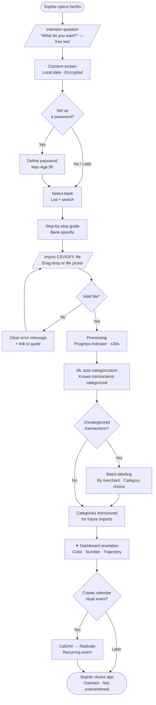
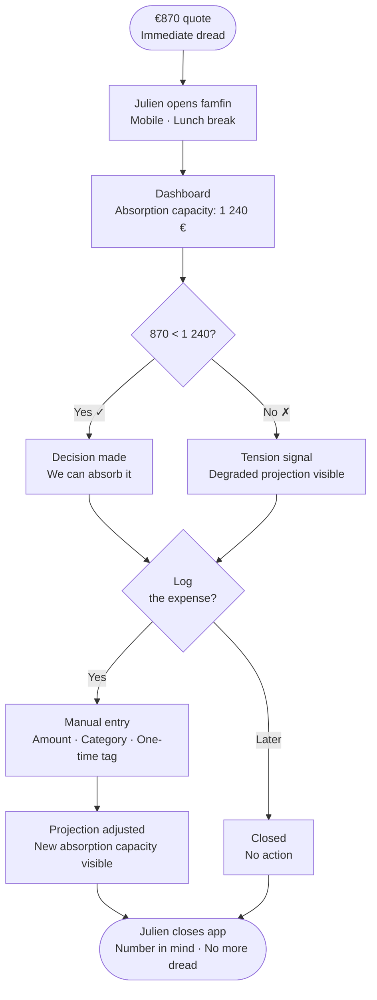

# UX Design Specification famfin

**Author:** kj
**Date:** 2026-04-11

---

<!-- UX design content will be appended sequentially through collaborative workflow steps -->

## Executive Summary

### Project Vision

famfin is a local-first household finance tool built for one family. Its founding principle: *finance in service of life — not the other way around.*

The central experience: a household expresses its life projects. famfin translates them into a realistic trajectory, visible together, adjustable in real time.

Opening the app produces calm. Designed for serenity, not retention.

### Target Users

The **Constrained Aspirationalist household** — two working adults (Sophie and Julien), stable income (~€3,500–6,000/month net), values-driven spenders, former Bankin users who quit due to upselling. Default emotional state: diffuse financial anxiety. Natural engagement asymmetry: one partner drives (Sophie), one resists then gradually takes ownership (Julien).

The product works when Sophie texts Julien *"I found something. Let's look at it together tonight."* That text is the measure of success.

### Key Design Challenges

1. **Dual emotional context** — desktop ritual mode (calm, planned, couple together at kitchen table) vs mobile consultation mode (sudden anxiety, one partner alone). Same interface, two opposite emotional states. The absorption capacity metric must be visible within 2 seconds on mobile — no tap, no submenu.

2. **First emotional contact** — onboarding arrives loaded with diffuse anxiety. The flow starts with intention (*"What do you want?"*), not data. Clarity must land before action.

3. **Couple engagement asymmetry** — the app must work for one partner without creating adoption debt for the other. Journey 4 (Julien's solo import) is a design constraint, not an edge case.

4. **Goals as life projects** — purchases are fuzzy, multi-purpose, emotionally charged. The goal form must feel like a declaration of intent, not a tax form. No imposed classification — the app asks 2–3 useful questions after a free-text description.

5. **Asynchronous receipt/transaction matching** — scanned receipts arrive T+0 (at purchase), bank CSV arrives T+1 to T+3. Pending-match state must be visible without triggering anxiety.

### Design Opportunities

1. **Absorption capacity as primary interface** — the anti-anxiety metric. Always visible on mobile. The answer to "can we afford this?" before the question is even asked.

2. **Ritual as UX feature** — stripped-down screen, clear progression, closure through joint plan validation. The ritual ends when both partners have validated the month's decisions.

3. **Multi-goal timeline** — life project portfolio with allocation simulation and couple arbitration made factual and visual. Horizontal timeline, color-coded feasibility, draggable goals.

4. **Earmarked resources** — Ticket Restaurant (Swile, Edenred, Sodexo) as a dedicated resource type: not income, not expense, but affectation. Monthly amount, per-transaction cap (€25), accumulated balance. API integration in V2; manual entry in V1.

5. **Receipt scanning** — photo → LLM extraction → itemized detail reconciled with bank transaction. Reuses existing `LlmProvider` infrastructure. Builds household purchase profile over time for food budget recommendations.

6. **Virtuous upgrade loop** — famfin grows with household hardware (Pi → mini-PC → local LLM → autonomous agents). Savings enabled by famfin fund the hardware that makes famfin smarter.

### Scope Clarification (V1 vs V2+)

**V1 — Clarity:**
- CSV/OFX import + categorization + learning engine
- Multi-goal simulation (free-text intent → structured goal → allocation timeline)
- Goal types: `generates_income` + `creates_expenses` booleans (not a rigid enum)
- Flexible goal schema: `metadata` JSON for future agent enrichment
- TR manual balance entry (monthly, during ritual)
- Receipt scan: photo → LLM → `receipt_items` + auto-match to bank transaction
- Pending-match state for receipts not yet debited
- Couple plan validation as ritual closure

**V2 — Trajectory:**
- Autonomy Pyramid + traffic-light trajectory screen
- API connection to Swile/Edenred (automated TR sync)
- Household purchase profile + price evolution tracking
- Personalized food budget recommendations
- Local LLM on mini-PC (Gemma 4 / LiquidAI) via existing `LlmProvider` trait

**V3+ — Agents:**
- Autonomous agents: real estate search, cost estimation, financing strategies
- Cross-goal optimization with AI-suggested allocation
- Structured purchase analysis (non-structural vs structural acquisitions)

## Core User Experience

### Defining Experience

The central action of famfin is **trajectory consultation** — opening the app and understanding in under 10 seconds where the household stands and what it can do next. Every other feature (import, scan, goals) feeds this answer.

The product is not a budgeting tool. It is a life project compass with real household numbers underneath.

### Platform Strategy

- **Platform:** Local web app (SvelteKit PWA), browser-based on home network
- **No mobile app:** PWA installable on home screen; browser access sufficient for V1
- **Two modes, one interface:** desktop for the monthly ritual (keyboard + mouse, both partners together), mobile for on-the-go consultation (touch, one partner alone, often anxious)
- **Context-first, not device-first:** the interface adapts to the emotional context of use, not the screen size alone
- **Offline consideration:** stale-while-revalidate via localStorage for primary metrics (absorption capacity, trajectory signal) — visible immediately on load even before API response

### Effortless Interactions

These actions must require zero friction — no menus, no confirmation dialogs, no cognitive load:

- **Absorption capacity visible on mobile** — present on main screen without any tap; the first pixel the user sees after opening
- **Receipt scan** — one tap on mobile → camera → photo taken → processing happens in background; user continues normally
- **Batch merchant recategorization** — select all "BIOCOOP LYON" → one action → applied to full history; never asked again
- **Monthly ritual closure** — both partners validate the month's plan with two taps; calendar event auto-generated

What should happen automatically without user intervention:
- Receipt matched to bank transaction when CSV arrives (date + amount + store triplet)
- TR balance flagged when accumulated surplus exceeds 2 months of average consumption
- Anomalies surfaced at ritual open, not pushed mid-day

### Critical Success Moments

| Moment | What must happen |
|---|---|
| First import | "I can finally see where the money goes" — fog lifts, no overwhelm |
| First goal simulation | "It's reachable if..." — concrete path, not vague aspiration |
| First shock absorbed | "We can handle this" — absorption capacity makes €870 manageable |
| First ritual closed together | "We decided something" — joint validation, sense of accomplishment |
| Julien's first solo import | "This is ours, not just Sophie's" — ownership transfers |

Make-or-break flows: the first import (must land on clarity, not data overload) and the absorption capacity display on mobile (must be immediate, must be correct).

### Experience Principles

1. **Clarity before everything** — each screen answers one question, exactly one. No dashboard encyclopedias.

2. **Emotional context first** — design adapts to the household's state (ritual calm vs consultation anxiety), not just the viewport size.

3. **Zero obligation** — receipt scanning, TR tracking, and goal creation are enrichments, never prerequisites. The core value works without them.

4. **Closure is a reward** — every completed action (ritual validated, goal funded, receipt matched, category learned) has satisfying closure. No open loops left visible.

5. **Trust through transparency** — what the app infers, it shows for confirmation. What it doesn't know, it says so. The "no conflicts of interest" claim is architectural, not declared.

## Desired Emotional Response

### Primary Emotional Goals

The primary emotional goal is **oriented calm** — not passive reassurance, not performance. Sophie closes the laptop knowing what to do next. Julien opens the app mid-crisis and feels the tension release — not because €870 is nothing, but because he can see it is handleable.

The emotional contract of famfin:
> famfin is honest by construction — not by policy. It has nothing to sell, nothing to hide, nothing to minimize. Its errors are steps in shared learning, not bugs to conceal. This radical transparency is what makes it trustworthy — and what commercial apps cannot structurally offer.

### Emotional Journey Mapping

| Moment | Desired emotion | Emotion to avoid |
|---|---|---|
| First import | Relief — *"finally a real picture"* | Overwhelm from data |
| Mobile consultation (shock) | Control — *"this is manageable"* | Anxious paralysis |
| Monthly ritual | Clarity + decision | Obligation, guilt |
| Goal simulation | Concrete hope — *"it's reachable if..."* | Frustration, unrealism |
| Ritual closure | Shared accomplishment | Incompletion, ambiguity |
| Returning to app | Confidence — *"I can look at this"* | Apprehension |
| Error / ML uncertainty | Partnership — *"we're learning together"* | Unpleasant surprise |

### On Resistance and Engagement Asymmetry

Resistance to a financial app, in men or anyone, comes from one of three roots: a bad past experience, a fear, or a lack of understanding of the subject. If famfin is transparent, clear, and vulgarizes budget management — that resistance dissolves naturally. The app does not need to "convince" less-engaged partners. It needs to remove every barrier to independent understanding.

Each session must be self-sufficient in context. A partner who hasn't opened the app in 3 weeks should understand the 3 main pieces of information on the home screen in under 30 seconds, without asking the other partner for help.

### Micro-Emotions

- **Confidence** (not skepticism) — ML/LLM inferences always shown for confirmation, never silent
- **Control** (not helplessness) — every anomaly or alert is accompanied by a possible action
- **Warm satisfaction** (not excitement) — no confetti, no streaks; quiet recognition when milestones are reached (*"You're making progress."*)
- **Belonging** (not isolation) — both partners recognize themselves in the tool equally

### Design Implications

- **Serenity** → restrained palette, readable typography, no urgency animations
- **Control** → every uncertainty surfaced with a resolution path; errors framed as collaboration, not failure
- **Trust** → all inferences presented for confirmation; open source link visible in-app; no data leaves the local network
- **Accomplishment** → explicit ritual closure screen; goal milestones acknowledged quietly
- **Universal clarity** → co-constructed with real household users through iterative testing, not prescribed via accessibility-specific design choices

### Emotional Design Principles

1. **Vulgarize without condescending** — no financial jargon without plain-language translation. Every metric has a real-life equivalent. *"34% of emergency fund"* → *"about 1 month of security built out of 3."*

2. **Errors are conversations, not failures** — *"I didn't recognize 8 items on this receipt — want to tell me what they are? I'll remember."* Never silent data loss, never technical error codes exposed to users.

3. **Absence of noise is the design** — every UI element that does not directly serve clarity or action is a potential parasite. When in doubt, remove it.

4. **Validation through co-construction** — UX quality is tested with real household users in real sessions, not against accessibility checklists. The goal: a first-time user answers "is this household in good shape this month?" correctly, without guidance.

5. **Quiet recognition, not gamification** — milestones are acknowledged with a sentence, a color shift, a moment of stillness. Never with points, badges, or pressure to return.

## UX Pattern Analysis & Inspiration

### Inspiring Products Analysis

**kj's references:**

| App | What works | famfin application |
|---|---|---|
| **NewPipe** (Android YouTube frontend) | Zero access friction, no account required, no ads, open source auditable, does exactly what's needed and nothing more | No login on local network, open source, interface that erases itself |
| **Claude / Claude Code** | Calibrated honesty, can disagree without systematic opposition, learning accelerator, collaborative rather than servile | ML that learns from corrections, projections that nuance without judging, contextual messages that ask rather than declare |

**Wife's references:**

| App | What works | famfin application |
|---|---|---|
| **Claude** (work + personal) | Same as above — trusted, honest, configurable voice | Shared reference point for the household |
| **Gemini** | Natural ecosystem integration — things arrive, you don't fetch them | CalDAV auto-sync, automatic receipt/transaction matching, TR data flows without manual intervention |
| **Apple** | Irreproachable polish, perceived simplicity, hardware-software coherence | Interface as refined as a commercial app regardless of underlying stack; Pi never visible in the UI |

**Key tension between the two users:** kj accepts friction when it gives control (NewPipe, Linux). His wife wants things to work immediately and elegantly (Apple, Gemini). This is the Sophie/Julien tension in product form — and both are the right testers for it. The resolution: simple surface, depth available for those who seek it.

### Transferable UX Patterns

**Navigation & Access:**
- No-account access (NewPipe) → already architectural in famfin; no login on local network
- Information comes to you (Gemini) → matching results, TR updates, anomalies surfaced at ritual open — not in submenus

**Interaction:**
- Inference shown, never silent (Claude) → every ML/LLM decision presented for confirmation
- Progressive depth (Apple) → simple surface, advanced settings exist but don't pollute the main screen
- Graceful degradation (NewPipe offline behavior) → stale-while-revalidate; last known values shown rather than error screen when Pi is slow

**Visual & Performance:**
- Perceived instant load (Apple launch animations) → SvelteKit + localStorage: screen renders with last known values before API responds; no blank screens
- Polish independent of stack → UI quality standard is commercial app, not developer tool

**Editorial Voice:**
- Calibrated, contextual, non-judgmental (Claude) → *"Your food spending increased this month — the birthday dinner on March 12 is probably the reason. Does that seem right?"* Not alarmist, not congratulatory
- No existing reference product nails this voice for personal finance — famfin has the opportunity to define it
- Editorial messages (anomalies, projections, suggestions) stored as external TOML/JSON templates, not hardcoded — iterable without recompilation

### Anti-Patterns to Avoid

- **Everything Bankin represents** — upsell, financial product ads, freemium limitations, commercial conflict of interest
- **Visible infrastructure** — user must never feel a server behind the interface; no "connection failed" screens, no loading spinners for primary metrics
- **Developer-facing UI** — technical terminology, dense screens, arbitrary colors, error codes exposed
- **Imposed access friction** — no account creation, no mandatory onboarding, no 12-step setup
- **Alarmist or condescending tone** — no "WARNING: spending up 23%", no "Great job saving this month!"
- **Static editorial voice** — messages that can't evolve as the household's relationship with the app matures

### Design Inspiration Strategy

**Adopt directly:**
- NewPipe's no-friction access philosophy → no login, no account, local network only
- Apple's perceived-instant-load pattern → stale-while-revalidate with localStorage
- Claude's calibrated voice → co-constructed editorial templates, iterable

**Adapt:**
- Gemini's ecosystem integration → famfin's integrations are local (CalDAV/Radicale, TR APIs in V2) but the *feeling* of data arriving without effort is the target
- Apple's progressive depth → power-user settings exist but are never the default view

**Avoid entirely:**
- Commercial app monetization patterns (Bankin, Honeydue)
- Any pattern that makes the household feel observed, judged, or sold to

**Co-construction method:**
The editorial voice and interface clarity will be validated through real household testing sessions — including with a user who brings a fresh eye to layout and language. No accessibility framework imposed top-down; clarity emerges from observed friction and iteration.

## Design System Foundation

### Design System Choice

**Selected: shadcn-svelte** (Svelte 5 port of shadcn/ui) + Tailwind CSS

### Rationale for Selection

- **Code ownership** — components are copied into the project (`src/lib/components/ui/`), not imported as a dependency. Nothing to maintain on the Pi, no upstream breaking changes.
- **No imposed aesthetic** — unlike Material Design (Google) or Skeleton UI (opinionated), shadcn-svelte provides solid foundations and a visual blank canvas. famfin's serene identity is built on top, not around a framework's look.
- **Accessibility by construction** — ARIA primitives built in (Radix UI heritage). Co-construction testing with household users is the quality gate; the foundation is already sound.
- **Bundle minimal** — Tailwind JIT purges unused CSS at build time on T460. Only used classes ship to Pi. Estimated dist/: ~50-80KB CSS + ~150KB JS.
- **Svelte 5 native** — components use runes natively, no legacy patterns. Stable since early 2025.
- **Background compatibility** — kj has Bootstrap and PureCSS experience; Tailwind utility-first is a paradigm shift, not a difficulty jump. Same token concept (`--bs-primary` → `tailwind.config.js colors`).

### Implementation Approach

```bash
# Initialize shadcn-svelte
npx shadcn-svelte@latest init
npx shadcn-svelte@latest add button card dialog input select table badge
```

**V1 critical components:**
- `Card` — metric blocks (absorption capacity, trajectory, goal progress)
- `Dialog` — ritual confirmations, goal creation, plan validation
- `Table` — transaction list with inline categorization
- `Badge` — receipt matching state (pending / matched / manual)

**Build pipeline:**
```makefile
build-frontend:
    cd famfin-frontend && npm run build
    # Vite + Tailwind JIT = automatic purge in production mode
```

Pi serves only the compiled `dist/` via Axum static file serving. Zero Node.js on Pi.

### Customization Strategy

**Design tokens** defined once in `tailwind.config.js` and mirrored in `src/lib/tokens.ts` for use in Svelte logic:

- **Color palette (max 3):** serenity neutral (main background/text), soft alert (orange — trajectory drift), quiet success (green — milestone, on track)
- **Typography:** single sans-serif family, generous line-height, no italic for critical information
- **Spacing:** consistent 4px grid via Tailwind spacing scale
- **No color-only signals:** every color-coded state (green/orange/red trajectory) always accompanied by a text label

**Developer tooling:**
- Tailwind CSS IntelliSense (VS Code) — day 1 install, halves the learning curve
- Component-first discipline: style `<AbsorptionCard>`, `<GoalTimeline>`, `<RitualScreen>` — never style pages directly

## Core User Interaction

### 2.1 Defining Experience

If famfin had one sentence — like Tinder's "swipe to match" — it would be:

> *"See at a glance where we stand, then decide what to do."*

Two entry points, same product:
- **Mobile / consultation:** *"I open the app, I see if we can afford it."*
- **Desktop / ritual:** *"We import the month, we see what changed, we decide together."*

This is not two products. It is one interaction with two emotional entry points — planned calm vs. sudden anxiety.

### 2.2 User Mental Model

Sophie and Julien arrive with a fuzzy representation of their financial situation — not wrong, just incomplete. famfin does not contradict them. It completes the picture. *"You thought you were spending €500 on food — it's €680. Here's why."* Clarity replaces intuition without treating intuition as failure.

The central UX innovation: **absorption capacity as the primary metric**, not bank balance, not monthly spending. The first number a user sees answers the question they actually have — *"can we handle an unexpected expense?"* — before they even ask it.

### 2.3 Success Criteria

| Criterion | Target |
|---|---|
| Mobile: absorption capacity visible | 0 taps from app open |
| Ritual: CSV imported and reviewed | Under 15 minutes end-to-end |
| First-time user reads main screen | Correctly interprets household status in under 30 seconds |
| Batch recategorization | One action, applies to full history, confirmed |
| Goal simulation updated | Instantly on parameter change (slider interaction) |
| Ritual closure | Both partners have validated; summary screen shown |

### 2.4 Novel UX Patterns

**Established patterns used:**
- Transaction list with inline edit (familiar from banking apps)
- Form-based goal creation (familiar from any productivity app)
- Progress bars for goal tracking (universal pattern)

**Novel pattern — emotional hierarchy:**
The dashboard does not lead with balance or spending total. It leads with **absorption capacity** — a derived metric that answers the real question. This is a deliberate inversion of conventional finance app hierarchy. Users will need one session to internalize it; after that, it becomes the number they look for first.

**Novel pattern — ritual mode:**
A distinct screen state activated by CSV import, not a separate page. The interface shifts register: anomalies surface one at a time, suggestions are inline, the session has a visible progression and a closure screen. Not a feature — a mode.

### 2.5 Experience Mechanics

#### Mobile Consultation Flow

1. **Open app** → absorption capacity visible immediately (localStorage stale value, API refresh silent)
2. **Tap metric** → detail panel slides up: breakdown of how the number is calculated
3. **Close** → return to main screen

#### Monthly Ritual Flow

| Step | User action | System response |
|---|---|---|
| Open | Navigates to ritual screen (or auto-prompted on 1st of month) | Ritual mode activates — clean layout, import CTA prominent |
| Import | Drags CSV file | Progress indicator within 200ms; processing max 30s |
| Review | Scrolls anomalies | One anomaly card at a time; suggested action inline |
| Categorize | Taps suggestion or picks from list | Instant confirmation; learning engine updates |
| Goals | Views timeline | Projection recalculated live; draggable goal dates |
| Close | Both partners tap "Validate" | Closure screen: 3 decisions summary + next ritual date |

#### Goal Creation Flow

1. **Free-text intent** — *"buy an apartment in Lyon"* (no category forced)
2. **Two clarifying questions** — *"How much approximately?"* / *"By when?"*
3. **Two behavior flags** — generates income? creates recurring expenses? (checkboxes, optional)
4. **Timeline appears** — goal placed on shared timeline; allocation impact shown immediately
5. **Save** — `metadata` JSON stores full intent text for future agent enrichment

## Visual Design Foundation

### Visual Identity Direction

**Reference universe:** HELO (Studio Entremondes) — used as design DNA, not reproduced. No characters, no collaboration. The visual language extracted and adapted to famfin's domestic context.

**Core commitment:** Strong, assumed visual identity throughout — not illustration as decoration at milestones only. The aesthetic IS the interface. famfin must be recognizable in one second, like Revolut or N26, but with warmth rather than cold tech.

### Color System

**Light mode (default):**
- Background: `#FAFAF8` — off-white, slightly warm, organic. Not flat CSS white. Evokes the near-white backgrounds of HELO character illustrations.
- Text primary: `#1C1C1E` — soft anthracite, not pure black
- Text secondary: `#6E6E73` — mid-grey for context text

**Dark mode (available, non-default):**
- Background: `#0D0D10` — deep near-black, like the IA data visualization backgrounds in HELO
- Text primary: `#F2F2F7`
- Accent: `#64D4C8` — cyan inspired by HELO data spectrum

**Signal colors (both modes — color + label, never color alone):**
- On track / success: `#34A853` (sage green, muted)
- Drift / warning: `#F5A623` (soft orange)
- Alert / critical: `#E8453C` (warm red, not aggressive)

**Philosophy:** Interface near-achromatic. Color is punctuation, not decoration. Appears only where it carries meaning.

### Typography System

**Direction:** Editorial presence, not generic corporate. Something with character that holds the weight of financial information with humanity.

**Candidate:** DM Sans (warmer than Inter, good screen rendering) or a pairing with a display face for large metric numbers.

**Financial figures:** `font-variant-numeric: tabular-nums` — all digit variants same width; columns align perfectly without effort. Applied globally to any element displaying monetary amounts.

**Scale principles:**
- Large metric display (absorption capacity, goal progress): 32–48px bold
- Section headers: 18–22px medium
- Body / transaction labels: 14–16px regular
- Captions / secondary info: 12px regular
- Generous line-height: 1.5–1.6 for body text
- No italic for critical financial information

### Illustration System

**Style DNA (from HELO):**
- Realistic semi-sketch with ink line quality
- "Carnet de voyage" texture — slightly imperfect, human
- Warm, grounded subjects — not tech/corporate
- Muted color palette on illustrations, expressiveness in composition

**famfin subjects** (domestic, not geopolitical):
- Kitchen table with open laptop and two coffee cups
- Two hands reviewing a screen together
- A notebook next to a phone
- Abstract expressionistic marks for data visualization accents

**Generation:** HELO style prompts (available in `docs/HELO/prompt-univers-HELO.txt`) adapted to domestic subjects. Output: SVG where possible, optimized PNG otherwise.

**Placement:** Not only at milestones — integrated into:
- Onboarding screens (intention-first question)
- Empty states (first import, no goals yet)
- Ritual closure screen
- Goal achievement
- Loading states (sketch-style animated illustration, not spinner)

### Spacing & Layout Foundation

**Base unit:** 4px grid (Tailwind default spacing scale)
**Layout feel:** Airy — generous whitespace, not dense. The near-white background needs room to breathe.
**Content width:** Max 720px centered on desktop ritual view; full-width on mobile
**Component spacing:** 24px between major sections, 12px within sections

### Asset Pipeline

```makefile
# justfile additions
optimize-assets:
    svgo --folder famfin-frontend/src/lib/assets/svg/
    # PNG optimization via sharp (Node script)
    node scripts/optimize-images.js
```

Vite handles asset imports natively — SVG inline in Svelte components, zero HTTP requests.

### Accessibility Considerations

- All color signals accompanied by text label (WCAG 1.4.1 — Use of Color)
- Contrast ratio target: 4.5:1 minimum for body text (WCAG AA)
- Dark mode toggle: stored in localStorage, respects `prefers-color-scheme` system setting
- Typography validation: co-construction sessions with household users determine if sizing/spacing works — no accessibility framework imposed top-down

---

## Design Direction Decision

### Design Directions Explored

Four directions were generated and evaluated across two HTML iterations:

- **A — Toile Vivante**: Dark painterly background with CSS blob gradients, hero number in DM Serif Display Italic, annotation cards, color shifts with financial trajectory
- **B — Carnet de Bord**: Cream Moleskine-style paper with grid lines, rubber-stamp annotations, rotated notebook aesthetic
- **C — Déclaration**: Radical minimalism — single 88–100px serif italic number occupies 70% of screen, full background changes color with financial state
- **D — Manuscript**: Three-column editorial desktop layout, dark masthead, typographic hierarchy as primary design element

Directions A and C were selected as the preferred foundation, with the explicit intent to push the visual approach further on both **painterly expressiveness** and **conceptual radicality**.

### Chosen Direction

**Toile Déclarative** — a fusion of A (painted canvas) and C (declarative full-screen number).

The entire screen background is a painted canvas whose color declares the financial state: deep forest green (serein), deep amber (tension), deep crimson (alerte). Over this canvas, organic SVG brushstroke paths — not CSS radial gradients — create directional paint marks with tapered ends and irregular edges. A Bézier brushstroke curve serves as the boundary between the painted zone and the bottom white card, replacing the conventional `border-radius` separator.

The hero number (DM Serif Display Italic, 100px) is the single dominant visual element. It occupies the upper two-thirds of the screen. The bottom card (cream `#F5EFE4`) carries the supporting metrics and actions.

**Neon dark variant**: an optional skin (deep black `#000005` base, luminous neon paint blobs, glowing tabular numbers) inspired by the HELO universe's AI visualization aesthetic. Persisted per device via `localStorage`. Toggle accessible directly from the main screen — not buried in settings.

### Design Rationale

- **The color IS the data**: Sophie opens the app and understands her financial state in under 200ms — before reading a single word. Green = calm. Amber = pay attention. Crimson = act now.
- **Painting as narrative, not decoration**: brushstroke paths are structural elements, not background texture. In future iterations, their size and intensity will be proportional to the absorption capacity value (larger blob = more financial headroom).
- **Radical reduction**: the first screen contains no navigation bar, no header chrome, no data tables. One number. One color. One signal pill. Everything else requires deliberate interaction (swipe up / tap).
- **Couple compatibility**: each device persists its own theme via `localStorage`. Sophie may prefer the light painted mode; Julien may prefer the neon dark mode. No account system needed.

### Implementation Approach

**State transition animation** (key differentiator):
- Svelte store `trajectoryState: 'serein' | 'tension' | 'alerte'`
- `lastSeenTrajectoryState` persisted in `localStorage`
- On dashboard component mount: if `currentState !== lastSeenTrajectoryState`, trigger entry animation
- Animation: new color blob grows from a screen corner via `transform: scale(0 → 1)` with `transform-origin` on the corner
- Duration: 800ms–1200ms, `cubic-bezier(0.22, 1, 0.36, 1)` (organic, not mechanical)
- Animation fires once per state change, not on every app open

**Neon dark skin**:
- CSS custom property swap: `:root[data-theme="neon"]` overrides all color tokens
- `localStorage.setItem('famfin-theme', 'neon' | 'light')` on toggle
- Toggle: small icon button top-right of main screen, outside the signal pill zone
- Respects `prefers-color-scheme: dark` as default if no explicit preference stored

**Brushstroke SVG approach**:
- Organic `<path>` fills (not `radial-gradient`) with bezier control points for tapered ends
- Card separator: `<svg>` with Bézier wave path overlaid at the paint/card boundary
- Canvas grain: inline SVG `feTurbulence` filter at 7% opacity, `mix-blend-mode: overlay`
- All SVG inline in Svelte components via Vite — zero additional HTTP requests

**Reference file**: `_bmad-output/planning-artifacts/ux-design-directions.html` (v4) — interactive showcase with 4 tabs: Mobile (3 states), Neon dark (2 states), Desktop, Palette & Typography.

---

## User Journey Flows

Four critical journeys mapped from PRD narratives to interaction flows. Each journey ends with a dashboard display — the color and number serve as the emotional closing moment.

### Journey 1 — The First Import ("The Fog Lifts")

**Persona:** Sophie, first session, 45 minutes alone on a Sunday.
**Entry point:** Fresh install, browser navigation to famfin.
**Emotional arc:** Vague dread → disorientation → revelation → orientation.



**Key UX decisions:**
- Intention question precedes any data input — establishes emotional contract before technical setup
- Consent screen is one sentence, not a legal document
- Import guide is bank-specific (per-bank instructions per FR25)
- Batch labeling by merchant: if "Carrefour" appears 12 times, one correction covers all 12
- Dashboard revelation is the climax — no intermediate summary screens

---

### Journey 2 — The Monthly Ritual ("The First of the Month")

**Persona:** Sophie and Julien, together, third month of use.
**Entry point:** Calendar event fires at 8pm on the 1st.
**Emotional arc:** Routine anxiety → structured container → shared discovery.

```mermaid
flowchart TD
    A([Calendar event 8pm]) --> B[Sophie opens famfin\nJulien present]
    B --> C[Dashboard · Current month state\nColor + absorption number]
    C --> D[/Import new CSV/]
    D --> E[Automatic deduplication\nComposite fingerprint]
    E --> F[Delta view\nWhat changed vs last month]
    F --> G{Anomaly\ndetected?}
    G -->|Yes| H[Anomaly surfaced first\nAmount · Merchant · Date]
    H --> I{One-time or\nrecurring?}
    I -->|One-time| J[Tagged · Excluded from trends]
    I -->|Recurring| K[Integrated into projection model]
    G -->|No| L
    J --> L[Projection updated]
    K --> L
    L --> M{Positive balance\nfor the first time?}
    M -->|Yes| N[Quiet signal:\n"Trajectory moving"]
    M -->|No| O
    N --> O[Subscription view\nAutomatic detection]
    O --> P{Unrecognized\nsubscription?}
    P -->|Yes| Q[Option: flag for review]
    P -->|No| R
    Q --> R([Ritual complete · 30 minutes])
```

**Key UX decisions:**
- Delta view is the primary view on ritual open — not the absolute numbers but the change
- One-time flagging is a first-class interaction, not buried in transaction detail
- Positive balance signal is quiet, not celebratory — a factual observation, not confetti
- Subscription anomaly detection runs automatically on each import (FR16)

---

### Journey 3 — The Unexpected Expense ("The Garage Quote")

**Persona:** Julien, Monday noon, mobile browser, stress response.
**Entry point:** Mechanic calls with €870 repair quote. Julien opens famfin during lunch break.
**Emotional arc:** Chest tightening → number sought → decision made → chest loosens.



**Key UX decisions:**
- Absorption capacity is the first visible number on mobile dashboard — designed for this exact use case
- No import required — consultation mode is read-only and instant (stale-while-revalidate from localStorage)
- Manual expense entry is optional, not required — the decision is the value, not the logging
- This journey requires zero explanation — the number answers the question before Julien forms it in words

---

### Journey 4 — The Partner's Awakening ("Julien's Turn")

**Persona:** Julien, alone, Sophie away on a work trip.
**Entry point:** Sophie asks Julien to run the monthly import.
**Emotional arc:** Mild anxiety (doing it wrong) → competence → ownership → belonging.

```mermaid
flowchart TD
    A([Sophie away\nJulien opens famfin alone]) --> B[Dashboard · First solo access\nVisually familiar state]
    B --> C[/Import this month's statement/]
    C --> D[CIC guide displayed\nScreenshot + step-by-step]
    D --> E[Julien exports from CIC\nCSV format · 3 guided clicks]
    E --> F[/Drag and drop file/]
    F --> G[Import processed\nCategories already learned]
    G --> H{Uncategorized\ntransactions?}
    H -->|2 transactions| I[Simple labeling\n"What is this?"]
    I --> J[Categories chosen\nMemorized for next time]
    H -->|None| J
    J --> K[Dashboard updated\nGoals · Savings · Trajectory]
    K --> L[Julien sees home purchase goal\nand emergency fund at 34%]
    L --> M[✦ Shift moment\n"This is our project"]
    M --> N([Julien takes a photo\nto show Sophie])
```

**Key UX decisions:**
- The bank-specific import guide removes the "doing it wrong" anxiety — Julien doesn't need to figure out the CSV export format
- Categories learned from Sophie's previous corrections carry forward automatically — the app already knows their household
- The dashboard is identical for both partners — no "his view" vs "her view", shared ownership is visual
- The shift moment (J4 climax) is unprompted — the app does not celebrate, Julien discovers

---

### Journey Patterns

**Navigation patterns:**
- Every multi-step flow has a back affordance — no one-way tunnels
- Import flows are resumable — partial uploads are rejected cleanly, not silently discarded

**Decision patterns:**
- One-time vs recurring: binary choice, surfaced immediately when anomaly detected, consequences shown in real time
- Category labeling: batch by merchant, not one transaction at a time — reduces labeling fatigue on first import

**Feedback patterns:**
- Operations > 1s: progress indicator visible within 200ms (NFR-P5)
- Errors: one clear sentence + one actionable link — no technical detail exposed to client
- Success states: always shown via dashboard color + number — not modal overlays or toast notifications

### Flow Optimization Principles

1. **Minimum steps to the number** — every journey is designed so that the absorption capacity figure is reachable in ≤ 3 taps from app open on mobile
2. **No dead ends** — error states always offer a recovery path (re-import, guide link, skip)
3. **Emotional pacing** — revelations (dashboard reveals, trajectory shifts) are never buried mid-flow; they are the final beat of each journey
4. **Shared state, not shared account** — both partners see identical data because they access the same local server, not because they have synchronized accounts
5. **Quiet acknowledgment over celebration** — trajectory improvements shown as factual signals ("Trajectory moving"), never as achievement unlocks or congratulatory animations

---

## Component Strategy

### Design System Components

shadcn-svelte provides the generic foundation — components are copied into the project (full code ownership, no runtime dependency).

| shadcn-svelte component | Usage in famfin |
|---|---|
| `Button` | Actions in bottom card, import flows |
| `Badge` | Base for `CategoryTag` (extended) |
| `Sheet` / `Drawer` | Mobile bottom sheet for transaction detail |
| `Dialog` | Error modals, one-time vs recurring confirmation |
| `Table` | Transaction list (desktop) |
| `Skeleton` | Loading states (stale-while-revalidate pattern) |
| `Tabs` | Desktop navigation (Dashboard / Transactions / Goals) |
| `Input` / `Select` | Import forms, category labeling |
| `Switch` | One-time toggle, CalDAV activation |
| `Toast` | Import success / error feedback (no stack trace exposed) |
| `Combobox` | Bank selection in onboarding |

Gap: shadcn-svelte does not cover financial display components or painted canvas elements — 10 custom components required.

### Custom Components

#### `PaintedCanvas`

**Purpose:** Full-screen painted background, state-aware. Root layer of the dashboard.
**Content:** Organic SVG brushstroke paths + vignette gradient + `feTurbulence` grain at 7% opacity, `mix-blend-mode: overlay`
**States:** `serein` (#001F12 base), `tension` (#1F0800 base), `alerte` (#1F0008 base), `neon` (#000005 base)
**Interaction:** Entry animation when `currentState !== lastSeenTrajectoryState` — new color blob grows from screen corner via `transform: scale(0→1)`, 800–1200ms, `cubic-bezier(0.22, 1, 0.36, 1)`. Theme toggle via long press or discrete button.
**Accessibility:** `role="presentation"` — decorative; state communicated by `SignalPill`

#### `AbsorptionHero`

**Purpose:** Monumental display of absorption capacity — the primary number.
**Content:** Sign (+/−), amount (DM Serif Display Italic), unit (€), eyebrow label, caption
**States:** `positive`, `near-zero` (< €200), `negative`
**Variants:** `mobile` (100px, full-screen upper zone), `desktop` (108px, left panel)
**Accessibility:** `role="status"`, `aria-label="Capacité d'absorption disponible : +640 euros"`
**Note:** `font-variant-numeric: tabular-nums` mandatory

#### `BrushstrokeSeparator`

**Purpose:** Visual boundary between painted zone and bottom card — replaces conventional `border-radius`.
**Content:** Inline SVG with Bézier path, fill matches `BottomCard` background
**Variants:** `cream` (light mode), `dark` (neon mode)
**Accessibility:** `aria-hidden="true"` — purely decorative

#### `SignalPill`

**Purpose:** Trajectory signal indicator — glowing dot + status text, backdrop blur.
**Content:** Color dot (box-shadow glow), status text string
**States:** `serein`, `tension`, `alerte` — color and glow adapted per state
**Accessibility:** `role="status"`, `aria-live="polite"`

#### `BottomCard`

**Purpose:** Structured content zone on cream background — emerges from painted canvas.
**Content:** Handle grip, month + partner names, `MetricCell` grid (3 columns), action row
**Variants:** `light` (cream #F5EFE4), `neon` (#0A0A14)
**Note:** Top edge is `BrushstrokeSeparator`, not a `border-radius`

#### `MetricCell`

**Purpose:** Individual cell within the metrics grid.
**Content:** Label (9px uppercase), value (DM Mono, tabular-nums), optional delta
**Value states:** `neutral`, `positive` (green), `warning` (amber), `negative` (crimson)
**Accessibility:** `role="cell"`, explicit label (e.g., "Revenus : 4 250 euros, en hausse de 3%")

#### `AnnotationCard`

**Purpose:** Floating glassmorphism card on the painted canvas — secondary insight.
**Content:** Label (8px uppercase), value (DM Mono), contextual sub-text
**States:** Value color adapts to canvas state (`em`, `amb`, `cri`, `neo`)
**Usage constraint:** Maximum 1 annotation visible on mobile, 2 on desktop

#### `ImportDropzone`

**Purpose:** CSV/OFX import zone — drag-drop or file picker.
**States:** `idle`, `dragover` (border highlight), `processing` (Skeleton overlay), `success`, `error`
**Validation:** Immediate rejection of unsupported formats with clear error message
**Accessibility:** `role="button"`, `aria-label="Importer un relevé bancaire"`, keyboard-activatable

#### `CategoryTag`

**Purpose:** Inline badge indicating categorization source.
**Variants:** `auto` (high-confidence ML, green), `ml` (low-confidence ML, purple), `one-time` (manually tagged, amber), `manual` (user-corrected, gray)
**Accessibility:** `title` attribute with descriptive text ("Catégorisé automatiquement par le modèle ML")

#### `ThemeToggle`

**Purpose:** Light / neon dark toggle, persisted to localStorage.
**Location:** Discrete button top-right of dashboard, outside `SignalPill` zone
**Behavior:** `localStorage.setItem('famfin-theme', 'neon' | 'light')` + `data-theme` swap on `<html>`
**Default:** Respects `prefers-color-scheme: dark` if no explicit preference stored
**Accessibility:** `aria-label="Activer le mode sombre"` / `"Activer le mode clair"`

### Component Implementation Strategy

- All custom components built with Svelte 5 runes (`$state`, `$derived`, `$effect`)
- Design tokens from `PaintedCanvas` propagate via CSS custom properties — child components inherit current state colors without prop drilling
- shadcn-svelte components styled via Tailwind CSS JIT utility overrides — no forking of upstream component code
- SVG assets (brushstrokes, separator) inlined in Svelte components via Vite — zero additional HTTP requests
- Component file structure: `famfin-frontend/src/lib/components/` with subdirectories by domain (`canvas/`, `financial/`, `import/`, `ui/`)

### Implementation Roadmap

**Phase 1 — Core (blocks critical journeys J1, J3)**

| Component | Journey | Rationale |
|---|---|---|
| `PaintedCanvas` | J1, J2, J3, J4 | Root of every screen |
| `AbsorptionHero` | J3 (mobile consultation) | Primary value on mobile |
| `BrushstrokeSeparator` | J1, J2, J3 | Required with BottomCard |
| `SignalPill` | J3 (instant read) | Trajectory at a glance |
| `BottomCard` + `MetricCell` | J2, J3 | Metric display |
| `ImportDropzone` | J1, J2, J4 | Core data entry |

**Phase 2 — Completion (full flows J2, J4)**

| Component | Journey | Rationale |
|---|---|---|
| `CategoryTag` | J1, J4 (labeling) | Labeling confidence indicator |
| `AnnotationCard` | J2 (delta, anomaly) | Floating insight overlay |
| `ThemeToggle` | All | Per-device theme preference |

**Phase 3 — Enhancement (comfort and polish)**

| Component | Usage | Rationale |
|---|---|---|
| `ProjectionBar` | Dashboard desktop, 6-month view | Historical visualization |
| `GoalCard` | Goals view (J4 — Julien discovers goals) | Goal tracking display |

---

## UX Consistency Patterns

### Button Hierarchy

Three levels, no more:

**Primary** — main action for the current context. Background color matches canvas state (`--em-bg` when serein, `--amb-bg` when tension, `--cri-bg` when alerte). White text. One primary button per screen or section.

**Secondary** — complementary actions. Neutral background (`rgba(0,0,0,0.05)` in light mode, `rgba(255,255,255,0.05)` in neon mode). Maximum 2 secondary buttons visible simultaneously.

**Destructive** — deletion, reset. Never on the main screen — always inside a confirmation `Dialog`. Crimson `#FF3358`. Never in a direct `ActionRow`.

**Labeling rule:** The primary button label adapts to the emotional context. Serein → "Ajouter". Tension → "Analyser". Alerte → "Comprendre". The app guides toward the appropriate action, not a generic list.

### Feedback Patterns

**Successful import:** Discreet `Toast` at the bottom — "X transactions imported · Y new categories learned". Duration: 4s. No modal, no confirmation page. The updated dashboard is the primary visual confirmation.

**Failed import:** Persistent `Toast` (no auto-dismiss) with a generic client-facing message (`IMPORT_FAILED`, `FILE_NOT_SUPPORTED`) and a "View guide for [Bank]" link. No technical error codes or stack traces ever exposed.

**Duplicate import (same file):** Discreet `Toast` — "No new transactions detected · Statement already imported". Not an error — a neutral confirmation that the action was received and processed correctly.

**Trajectory change:** `PaintedCanvas` entry animation (new color blob grows from screen corner, 800–1200ms). No push notification, no badge — the entire screen is the notification. famfin waits to be consulted; it does not intrude.

**LLM unavailable → ML fallback:** Contextual message in the categorization view: "Categorization assisted by the local model (LLM unavailable)". `CategoryTag` displays `ml` instead of `auto`. Transparent, non-blocking.

**CalDAV unavailable:** Silent at runtime — event is retried on next import. Notification only in the Configuration view.

### Form Patterns

**Category labeling (J1, J4):** One unknown transaction → one question → one action. Format: merchant name as heading, 4–6 suggested categories (most probable first, "Other" last). Immediate validation on tap — no "Confirm" button. The selection gesture is the confirmation.

**Batch by merchant:** If "Carrefour" appears 12 times in the import, one question covers all 12. The learned rule is shown: "This rule will apply to X future occurrences of this merchant."

**One-time flag (J2):** Minimal `Dialog` — two options only: "One-time expense" and "Recurring". Consequence shown immediately below each option ("If one-time: excluded from trends and projection"). No required free-text field.

**Category correction:** Always accessible via tap on a transaction. Individual correction or "Apply to all [Merchant]". Batch correction is systematically offered if the merchant appears ≥ 2 times.

### Navigation Patterns

**Mobile:** No persistent bottom navigation bar. Context-driven navigation:
- Dashboard → tap "Transactions" in `BottomCard` → transaction list
- Dashboard → tap "Objectifs" → goals view
- Back: swipe right or "‹" button top-left
- No global navigation visible on the main screen — the painted canvas is deliberately chrome-free

**Desktop:** `shadcn/tabs` in the right panel. "famfin · [month year]" masthead fixed top-left of the painted panel. No sidebar — the left panel is the declaration, not a menu.

**Maximum depth:** 2 levels from dashboard on mobile. Dashboard → transaction list → transaction detail. Never 3 levels deep on mobile.

### Loading and Empty States

**First access (no data):** Intention screen shown directly — no empty dashboard. The app never shows a zero state; it asks for intention before displaying anything. Emptiness is never rendered.

**Initial load (stale-while-revalidate):** Values from `localStorage` (absorption capacity, trajectory signal) display immediately. The `BottomCard` shows the last import date as secondary text (e.g., "Last imported: April 1 · 10 days ago") — this communicates data freshness without implying staleness anxiety. No freshness indicator on `SignalPill`.

**Import in progress:** `ImportDropzone` enters `processing` state with a `Skeleton` overlay and a linear progress indicator. No centered spinner — the drop zone remains visible to inform the user what is being processed.

**Month with no transactions:** Contextual sentence in `BottomCard`: "No transactions imported for [month]. You can import a statement when it becomes available." No illustration, no elaborate zero-state.

### Error Patterns

| Scenario | Pattern |
|---|---|
| Invalid CSV file | Persistent `Toast` + bank guide link |
| Session expired (> 8h) | Redirect to unlock screen — no navigation loss |
| LLM timeout | Silent fallback to ONNX + `CategoryTag` `ml` visible |
| CalDAV unavailable | Silent at runtime, shown in Configuration |
| Duplicate import | Discreet `Toast` "No new transactions · Already imported" |
| LAN connection lost | Persistent `Toast` "Server connection lost" — app remains readable (stale data) |

**Core rule:** No error blocks consultation. The app can always display the last known data, even during a momentary local server outage.

### Categorization Confidence Pattern

A discreet indicator in the dashboard view — visible but not intrusive: "98% categorized · 2 pending". Available to users who look for it; does not demand attention.

- Not a red badge, not a warning — a factual statement
- Tapping the indicator navigates to the pending transactions for labeling
- Fulfills the product promise: famfin does not pretend to have categorized what it hasn't

### Modal and Overlay Patterns

**Confirmation `Dialog`:** Only for irreversible actions (deletion) or high-impact decisions (one-time flag). Maximum 2 actions: primary action (colored) + "Cancel" (secondary). Never more.

**`Sheet` / mobile bottom sheet:** For transaction detail — slides up from bottom, semi-transparent backdrop. Dismissed by swipe down or backdrop tap.

**`AnnotationCard` (floating overlay):** Manually positioned in the painted canvas — never above `AbsorptionHero`. Dismissable by tap when screen space is needed.

---

## Responsive Design & Accessibility

### Responsive Strategy

famfin has two distinct usage modes that drive two distinct layouts — not three generic breakpoints:

**Mobile consultation mode** (Julien, J3): full screen = painted canvas. `AbsorptionHero` occupies the upper two-thirds. `BottomCard` rises from the bottom. No superfluous chrome. Optimized for a read in under 5 seconds without interaction.

**Desktop ritual mode** (Sophie + Julien, J1 + J2): 2-panel layout. Left panel (300px fixed) = the painted declaration. Right panel (flex, glassmorphism background) = the data. Each panel is visually autonomous.

**Tablet (768–1023px):** Mobile layout with increased padding — not a distinct layout. Tablet is not an identified usage mode in the journeys.

### Breakpoint Strategy

```
Mobile-first:
  base (< 768px)  → PaintedCanvas full-screen, BottomCard fixed bottom
  md   (≥ 768px)  → BottomCard taller (320px), 3-column metrics preserved
  lg   (≥ 1024px) → 2-panel desktop layout
  xl   (≥ 1280px) → Left panel 320px, hero number slightly larger
```

Fluid units throughout:
- Hero number: `clamp(72px, 15vw, 108px)` — adapts without breakpoint
- Spacing: `clamp(16px, 4vw, 32px)` for main paddings
- No fixed pixel values for layouts — `rem`, `%`, `vw`, `clamp()` exclusively

### Accessibility Strategy

**Target: WCAG AA** — industry standard, adopted by conviction of clarity for a private domestic app.

**Core principles:**

- Color is **never** the sole information vector. Each canvas state (serein / tension / alerte) is accompanied by the `SignalPill` text label. The hero number also changes sign (+/−). Triple signal: color + text + sign.
- Financial figures carry explicit `aria-label` values: `aria-label="Capacité d'absorption disponible : plus 640 euros"` — the `+` symbol is verbalized.
- `font-variant-numeric: tabular-nums` on all `MetricCell` and `AbsorptionHero` — visual alignment and machine readability.
- Co-construction with Sophie (dyslexic): no dedicated font imposed. Co-construction sessions will validate text size, letter spacing, and detail view density. Adjustments will be shared decisions, not design assumptions.

**Color contrast targets:**

| Pair | Target ratio | Status |
|---|---|---|
| White text on green canvas #001F12 | > 7:1 | AA large ✓ |
| White text on amber canvas #1F0800 | > 7:1 | AA large ✓ |
| `--em` #00D97E on white cream | > 4.5:1 | AA ✓ |
| MetricCell text (#1C1C1E) on #F5F5F7 | > 12:1 | AAA ✓ |
| Positive value (#009B54) on cream | > 4.5:1 | Verify in session |

**Touch targets:** All action buttons minimum `44×44px`. `CategoryTag` tap zone extended via invisible padding. `ThemeToggle` minimum `44×44px` regardless of visual size.

**Keyboard navigation:** Focus order: `ImportDropzone` → `BottomCard` actions → `ThemeToggle`. `PaintedCanvas`: `tabindex="-1"`. Skip link at page top, visible on focus.

**Reduced motion (amended):** `@media (prefers-reduced-motion: reduce)` suppresses the blob `transform: scale()` animation only — the `background-color` transition at 600ms ease is preserved. The color *paints* progressively without any element moving. Compliant with the W3C spec (vestibular-safe), narratively intact.

### Testing Strategy

**Responsive testing:**
- Playwright E2E viewports: `375×812` (iPhone SE), `390×844` (iPhone 14), `1280×800` (laptop)
- Real device testing on Sophie's and Julien's actual devices — identified during co-construction
- PWA validation: `manifest.json`, `meta viewport`, home screen icons

**Automated accessibility testing:**
- axe-core integrated in Playwright — catches ~35% of WCAG violations automatically
- Covers: missing aria-labels, insufficient contrast on static elements, form field associations

**Manual accessibility checkpoints** (famfin-specific — not covered by axe-core):
1. Hero number contrast during canvas state transition animation
2. `AnnotationCard` legibility on all three canvas states (serein / tension / alerte)
3. `CategoryTag` tap target size in a real transaction list on mobile
4. `SignalPill` readability at arm's length (mobile, outdoor light simulation)
5. Keyboard-only complete flow: J1 first import (import → labeling → dashboard)
6. VoiceOver (iOS Safari): navigation to `AbsorptionHero` and `SignalPill` verbalization
7. Canvas animation behavior under `prefers-reduced-motion: reduce`
8. Theme toggle persistence across browser close/reopen

**Co-construction session with Sophie:**
- Timing: Session 1 after MVP completion
- Scope: 3 critical views on real mobile device — dashboard, transaction list, import flow
- Method: observation without coaching — Sophie uses the app, friction points are noted
- Output: documented friction inventory, prioritized iteration list
- Subsequent sessions as needed based on findings

### Implementation Guidelines

**Responsive:**
```css
/* Mobile-first base */
.absorption-hero { font-size: clamp(72px, 15vw, 108px); }
.bottom-card { height: 262px; }

/* Desktop layout */
@media (min-width: 1024px) {
  .app-layout { display: flex; }
  .painted-panel { width: 300px; flex-shrink: 0; }
  .data-panel { flex: 1; }
}

/* Reduced motion — preserve color transition, remove transform */
@media (prefers-reduced-motion: reduce) {
  .canvas-blob { animation: none; }
  .painted-canvas { transition: background-color 0.6s ease; }
}
```

**Accessibility:**
```svelte
<!-- AbsorptionHero -->
<div role="status"
     aria-label="Capacité d'absorption disponible : {sign}{amount} euros">
  <span aria-hidden="true">{sign}{amount}<span class="unit">€</span></span>
</div>

<!-- SignalPill -->
<div role="status" aria-live="polite"
     aria-label="Trajectoire : {trajectoryLabel}">
  <span class="sig-dot" aria-hidden="true"></span>
  <span>{trajectoryLabel}</span>
</div>

<!-- ThemeToggle -->
<button aria-label={theme === 'neon' ? 'Activer le mode clair' : 'Activer le mode sombre'}
        on:click={toggleTheme}>
</button>
```

**PWA manifest — deliberate static choice:**
```json
{
  "name": "famfin",
  "short_name": "famfin",
  "display": "standalone",
  "orientation": "portrait",
  "theme_color": "#001F12",
  "background_color": "#001F12"
}
```
Note: `theme_color` is static (`#001F12` — serein green). It cannot reflect runtime financial state. This is a deliberate choice — the status bar color represents the app's identity, not the current trajectory.
